# Hi, I'm Austin Dilan Datan (Apollo / The Reverie)

> Graphic Designer | IT Student | Aspiring UI/UX Developer  
> My style? A clash of **Maximalism × Neobrutalism × Surrealism × Botany**.  
> My mission? To blend **design aesthetics** with **functional tech**.

---

## About Me
- Information Technology student from the University of Science and Technology of Southern Philippines 
- 8+ years designing, from editorial design to maximalism to surrealism  
- UI/UX enthusiast who loves creating bold, expressive interfaces  
- Believer in tech × art where visuals meet function  

---

## Tech Stack
**Languages & Frameworks**  

  

**Tools of Choice**  
- VSCode | Figma | Photoshop | Canva | Behance 

**What I’m Exploring**  
- UI systems that feel alive  
- Themed dashboards and neobrutalist web layouts  

---

## Projects

- **USTP Student Attendance System**
  A campus-level system for tracking student participation in events and classes.  
  Built to replace manual logbooks with a **faster, centralized, error-free** digital approach.
  

  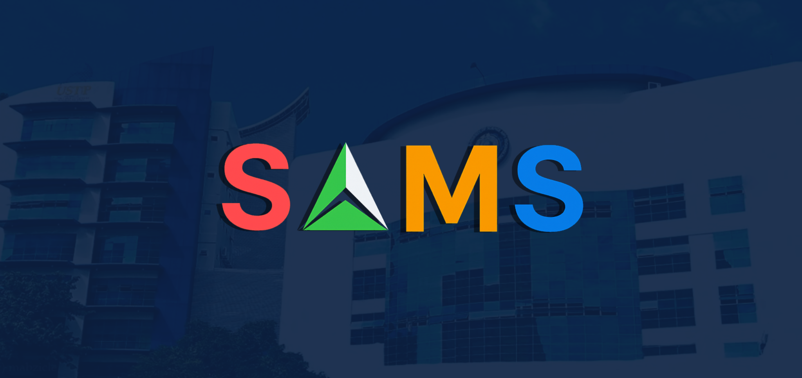
  
  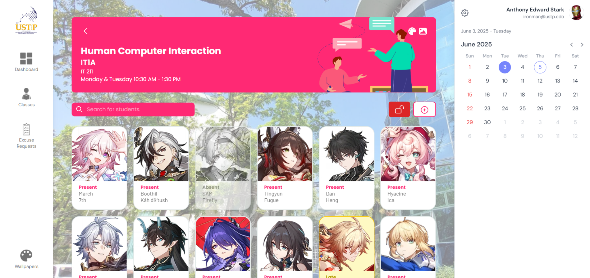
  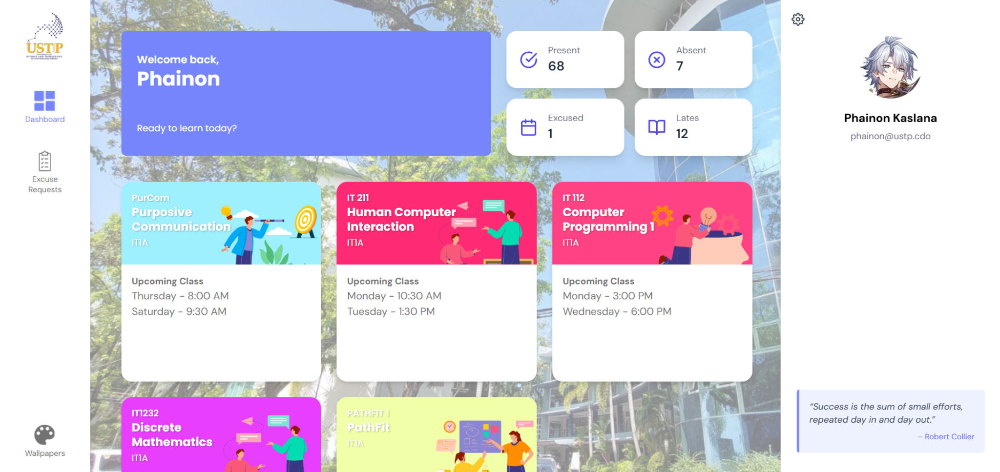
  

- **Sabrosa**  
  A **food e-commerce & delivery platform prototype**.  
  Supports multiple snack brands under one platform with a fresh UI concept.
  

  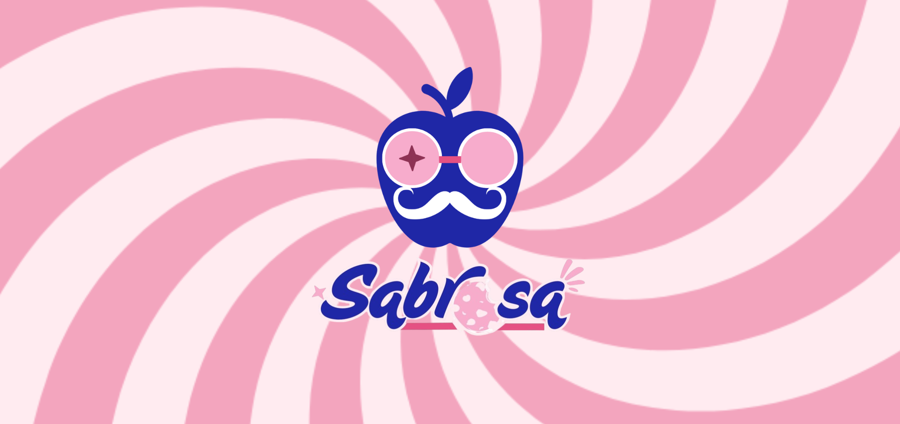
  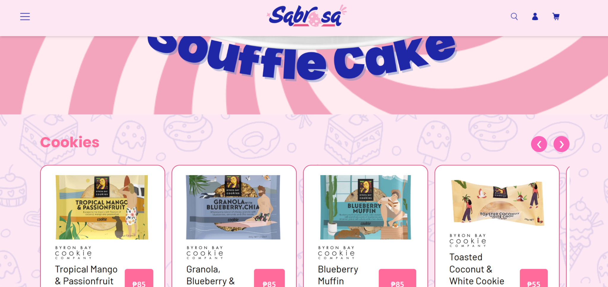
  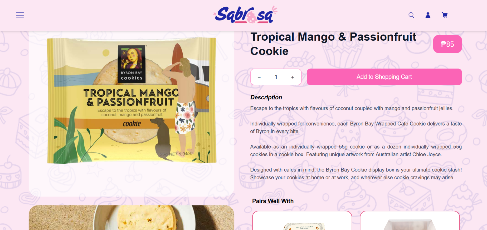
  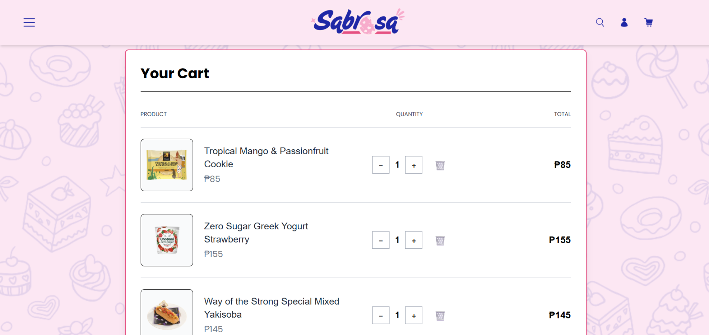
  

- **Apollo (Portfolio Website)**  
  My personal portfolio, crafted with **HTML, CSS, and JS**.  
  A playground for experimenting with **UI/UX + graphic design elements**.
  

  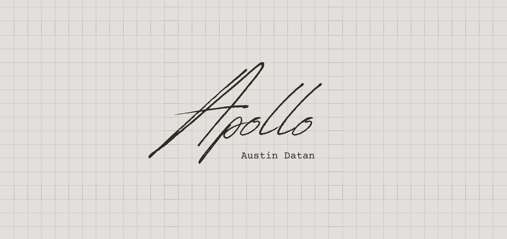
  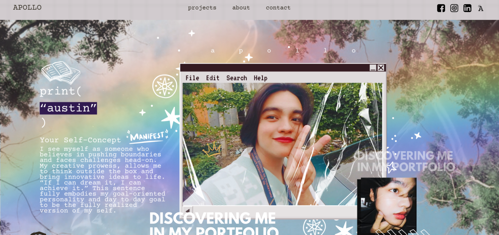
  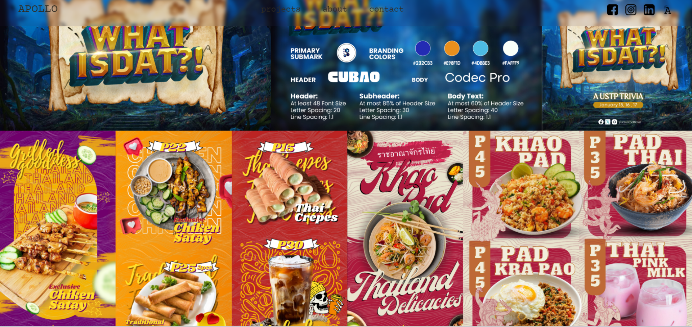
  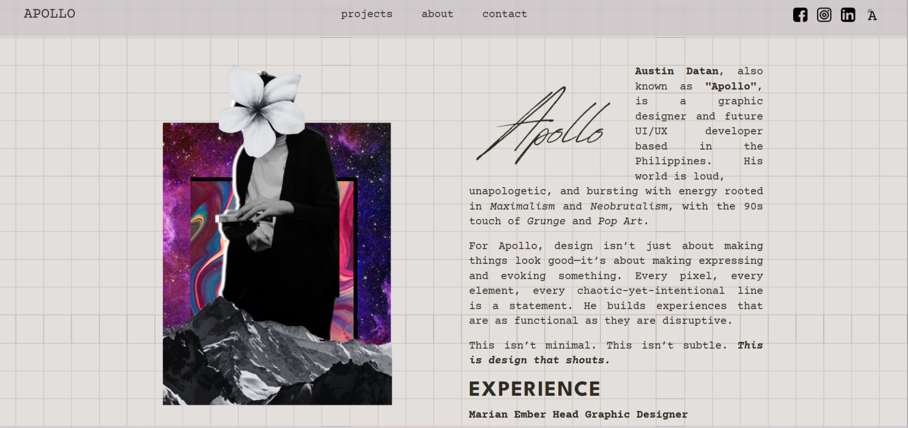
  

---

## Design Work
I don’t just code. I design with impact.  
Here are some of my visual playgrounds:

- [Behance Collections]: Still compiling....
- [Design Portfolio](https://drive.google.com/drive/folders/1rEgQEuASnoaig2T-FoAB-_GaDQ9VcFQC) A link to my works! Here's a preview for some of them.
  

  
  
  
  

  
  
  

---

## Connect with Me
- [Email](mailto:austindatan@gmail.com)  : austindatan@gmail.com
- [LinkedIn](https://www.linkedin.com/in/austindatan/)  : https://www.linkedin.com/in/austindatan/
- [Instagram](https://www.instagram.com/dilan_06p5/#)  : https://www.instagram.com/dilan_06p5/ (currently private, will open soon)
- [Facebook](https://www.facebook.com/austin.datan/)  : https://www.facebook.com/austin.datan/

---

 *Code. Design. Create. Repeat.*  
